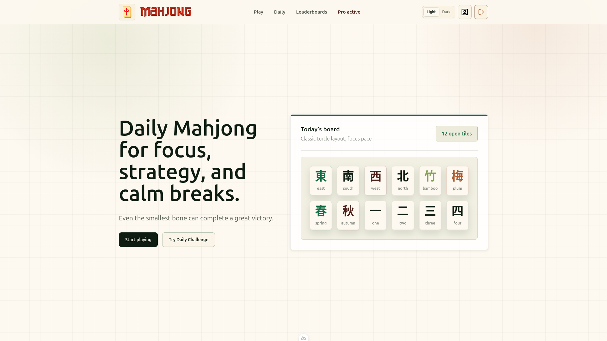
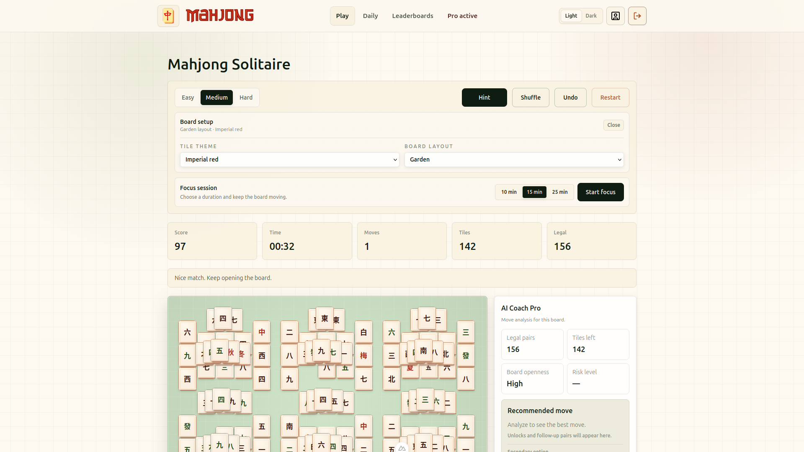
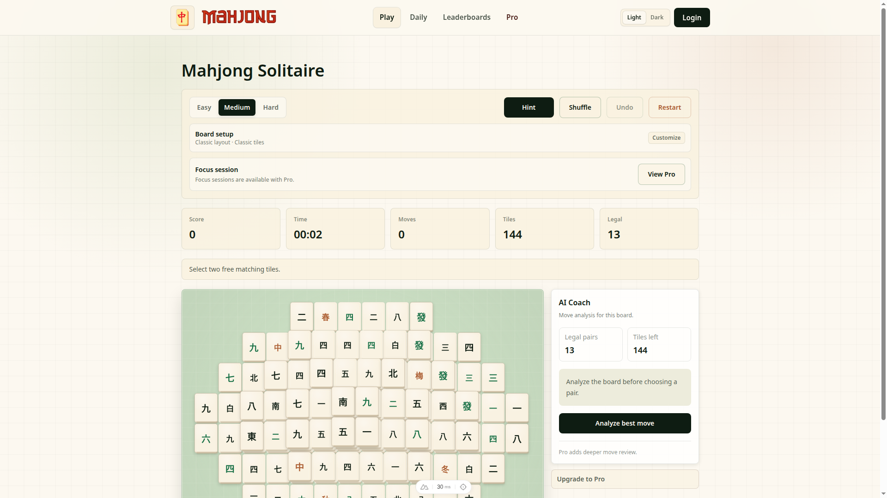
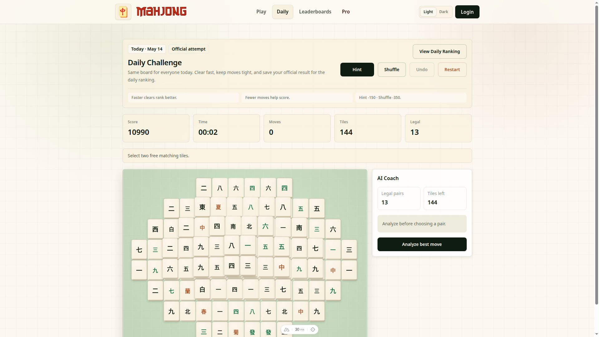
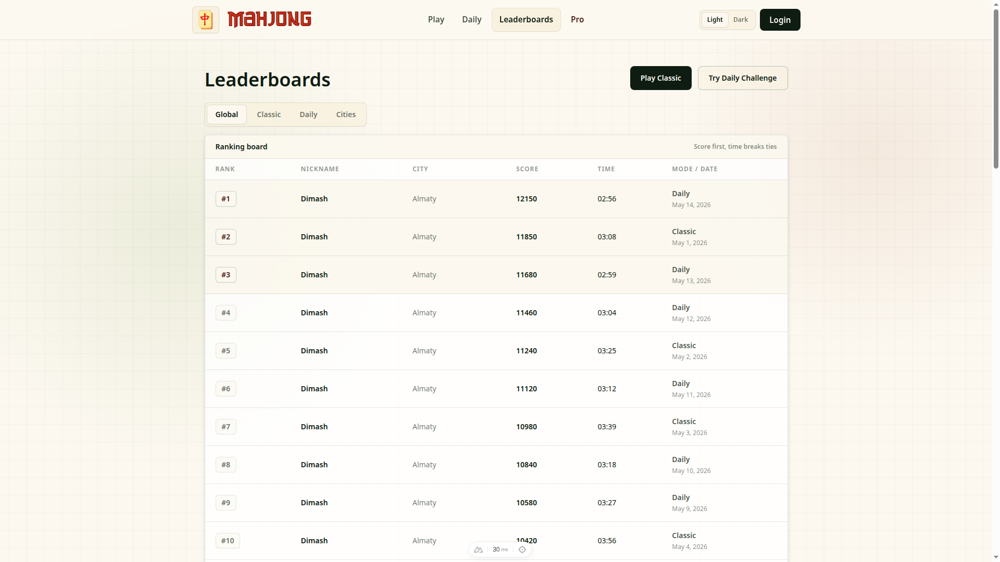
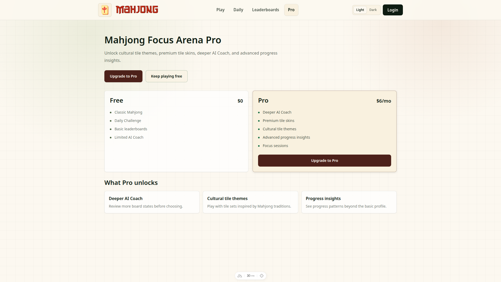
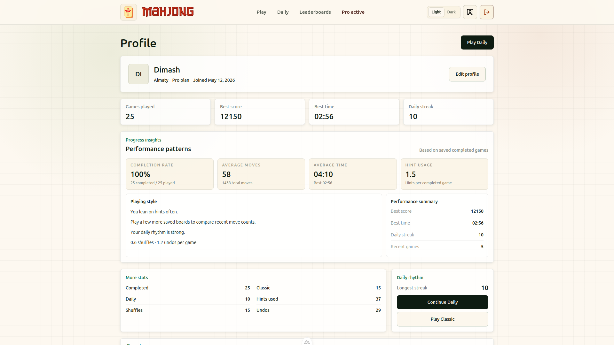

# Mahjong Focus Arena

A calm, responsive Mahjong Solitaire web app with Daily Challenge, AI Coach, Pro features, Supabase Auth, leaderboards, themes, layouts, progress insights, focus sessions, and dark mode.

## Screenshots

| Landing | Classic Play |
|---|---|
|  |  |

| AI Coach Pro | Daily Challenge |
|---|---|
|  |  |

| Leaderboards | Full Leaderboard |
|---|---|
|  |  |

| Pro Dashboard | Profile Insights |
|---|---|
|  |  |

## Features

### Core

- 144-tile Mahjong Solitaire
- Classic Play
- Daily Challenge
- Hint, shuffle, undo, and restart
- Score, timer, moves, and legal pairs

### Auth / Profile

- Supabase email/password authentication
- Profile page with editable player details
- Password reset flow
- Recent games and profile stats

### Competitive

- Global leaderboard
- Daily leaderboard
- City leaderboard with Almaty focus
- Safe leaderboard reads through Supabase RPC

### AI Coach

- Rule-based move analysis
- Best move recommendation
- Pro advanced analysis
- Secondary option plus risk and openness metrics

### Pro Features

- Demo Pro activation
- Premium tile themes
- Multiple board layouts
- Deeper AI Coach
- Progress insights
- Focus sessions

### UI

- Responsive mobile and tablet layout
- Light/dark theme
- Clean Mahjong-inspired design

## Free vs Pro

| Feature | Free | Pro |
|---|---:|---:|
| Classic Play | ✅ | ✅ |
| Daily Challenge | ✅ | ✅ |
| Basic AI Coach | ✅ | ✅ |
| Advanced AI Coach | — | ✅ |
| Premium tile themes | — | ✅ |
| Board layout selector | Limited | ✅ |
| Progress insights | — | ✅ |
| Focus sessions | — | ✅ |
| Dark mode | ✅ | ✅ |

## Tech Stack

- Nuxt 3
- Vue 3
- TypeScript
- Tailwind CSS
- Supabase Auth
- Supabase Postgres
- Supabase RLS

## Getting Started

```bash
npm install
cp .env.example .env
npm run dev
```

The app runs locally at:

```txt
http://localhost:3000
```

## Environment Variables

Create a local `.env` file from `.env.example` and fill in your Supabase project values.

```env
NUXT_PUBLIC_SUPABASE_URL=https://your-project-ref.supabase.co
NUXT_PUBLIC_SUPABASE_ANON_KEY=your-supabase-anon-key
```

Only public Supabase frontend values are required. Do not commit `.env`, service role keys, or private credentials.

## Supabase Setup

1. Create a Supabase project.
2. Enable email/password authentication.
3. Open the Supabase SQL Editor.
4. Run `supabase/schema.sql`.
5. Add local and deployed URLs to Supabase Auth settings.

Local Auth URLs:

```txt
http://localhost:3000
http://localhost:3000/reset-password
```

Deployment Auth URLs:

```txt
https://your-deployed-app.example
https://your-deployed-app.example/reset-password
```

## Database

The project uses Supabase Postgres with RLS enabled.

| Resource | Purpose |
|---|---|
| `profiles` | Public-safe profile data |
| `games` | Completed Classic and Daily results |
| `get_leaderboard_entries` | Safe leaderboard RPC |

Email addresses remain in Supabase Auth and are not stored in the public profile table.

## Development Scripts

| Command | Description |
|---|---|
| `npm run dev` | Start the Nuxt dev server |
| `npm run build` | Build for production |
| `npm run preview` | Preview the production build |
| `npm run generate` | Generate static output |

## Deployment

Recommended deployment target: Vercel.

1. Push the project to GitHub.
2. Import the repository in Vercel.
3. Add the required Supabase environment variables.
4. Deploy.
5. Add the Vercel URL and reset-password URL to Supabase Auth redirect settings.

## Pro Activation Note

The Pro flow is a demo activation for this MVP. It does not process real payments, request card details, or store card data.

## Project Notes

- Daily Challenge boards are deterministic by date.
- AI Coach is rule-based and does not call an external LLM.
- Leaderboards are backed by Supabase.
- `.env`, `node_modules`, `.nuxt`, `.output`, and local tooling folders are ignored by git.

## License

This project is intended as a portfolio and assignment MVP. Add a license before public reuse or distribution.
